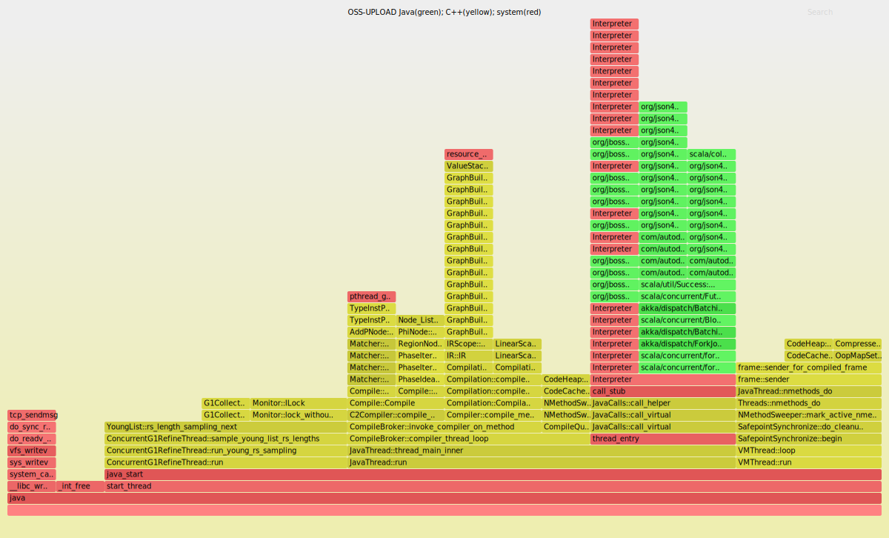
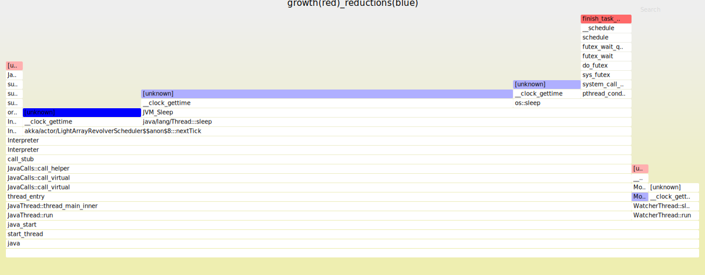
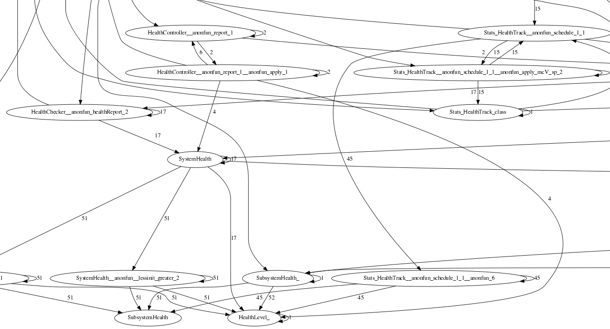
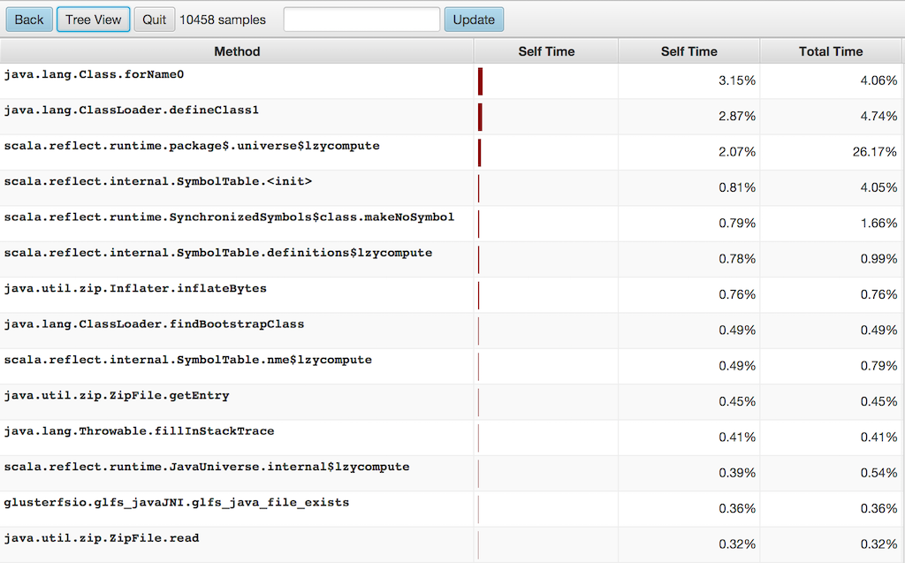
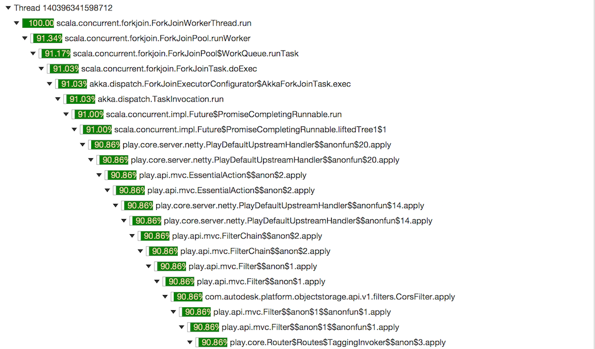

# JVM profilers

## Projects

* perf-map-agent - This is a JVMTI agent ```(libperfmap)``` that provides Java symbol translation for perf_events.
It uses ```$JAVA_HOME/lib/tools.jar``` library to attach to the process, so check if the file exists on your system (it should for JDK 8+).

Pre install linux ```perf_events``` - This is the standard Linux profiler, aka “perf” after its front end, and is included in the Linux source (tools/perf).

Upgrade Java to version 8 update 60 build 19 (or newer) - This includes the frame pointer patch fix (JDK-8072465), which is necessary for Java stack profiling.


* flame-graph - This is some Perl software for generating flame graphs. It contains ```stackcollapse-perf.pl```, for processing perf_events profiles, and ```flamegraph.pl```, for generating the SVG flame graph, e.g.:

[](flamegraph-oss.svg)

We can also generate differential flame graphs, e.g.:

[](diffgraph.svg)

The intent is for use with before & after profiles, such as for non-regression testing or benchmarking code changes.

* call-graph - This is a tiny java agent which uses Java instrumentation capabilities to captures the dynamic execution flow of a JVM program, e.g.:
[](callgraph-oss.jpg)

* honest-profiler - This is a small C++ JVMTI agent ```(libhonestprof)``` which writes out a log file describing a profile of the application it has been attached to.
Then a Java clients (```honest-profiler/client/console```, ```honest-profiler/client/gui```) can render/display a profile based on this log.

Honest profiler takes the same approach outlined by Jeremy Manson/Google in [lightweight-java-profiler](https://code.google.com/p/lightweight-java-profiler) where calls are made to the ```AsyncGetCallTrace``` jvm method which avoids the need for threads to reach a safe point in order to read their call trace. Consequently it avoids a number of profiler accuracy issues that other sampling profilers suffer from.

[](hp-flatview.png)

[](hp-treeview.png)

* Attach.java - This is a Java bootstrap application ```(agent.jar)``` which attaches the agent (e.g.: libperfmap or libhonestprof) to a running Java process.

## How to build and run.

```sh
$ cmake .
$ make
```

Make will compile all agents (agent.jar, libperfmap.so, libhonestprof.so) into ```build``` directory, so following commands let attach to a running Java process:
```sh
$ java -cp agent.jar:$JAVA_HOME/lib/tools.jar Attach <PID> libperfmap.so

$ java -cp agent.jar:$JAVA_HOME/lib/tools.jar Attach <PID> libhonestprof.so interval=10,logPath=/tmp/log.hpl

# Generate flame graphs
$ ./perf-map-agent/bin/perf-java-flames <PID>
```


## Notes

* Linux perf_events are part of linux kernel tools. Because all processes running inside container(s) run on the same kernel as outside processes,
so if we want to sample performance events for the process running inside docker container we can do from outer process:
```sh
#
# Get PID for process running inside docker container
#
$ sudo docker top d8195f1bfbaa
UID                 PID                 PPID                C                   STIME               TTY                 TIME                CMD
root                3674                841                 0                   13:05               ?                   00:00:00            /bin/sh /opt/run.sh
root                3703                3674                0                   13:05               ?                   00:00:04            /usr/lib/jvm/java-7-openjdk-amd64/bin/java -Dzookeeper.log.dir=. -Dzookeeper.root.logger=INFO,CONSOLE -cp /opt/zookeeper/bin/../build/classes:/opt/zookeeper/bin/../build/lib/*.jar:/opt/zookeeper/bin/../lib/slf4j-log4j12-1.6.1.jar:/opt/zookeeper/bin/../lib/slf4j-api-1.6.1.jar:/opt/zookeeper/bin/../lib/netty-3.7.0.Final.jar:/opt/zookeeper/bin/../lib/log4j-1.2.16.jar:/opt/zookeeper/bin/../lib/jline-0.9.94.jar:/opt/zookeeper/bin/../zookeeper-3.4.6.jar:/opt/zookeeper/bin/../src/java/lib/*.jar:/opt/zookeeper/bin/../conf: -Dcom.sun.management.jmxremote -Dcom.sun.management.jmxremote.local.only=false org.apache.zookeeper.server.quorum.QuorumPeerMain /opt/zookeeper/bin/../conf/zoo.cfg

#
# Print report
#
$ sudo perf record -F 99 -o /tmp/pid-3703.data -g -p 3703 -- sleep 10
[ perf record: Woken up 1 times to write data ]
[ perf record: Captured and wrote 0.063 MB /tmp/pid-3703.data (~2748 samples) ]

$ sudo perf report -i /tmp/perf-3703.data --stdio

#
# Samples: 3  of event 'cpu-clock'
# Event count (approx.): 30303030
#
# Overhead  Command     Shared Object                  Symbol
# ........  .......  ................  ......................
#
   100.00%     java  [vdso]            [.] 0x0000000000000978
               |
               --- 0x7ffc19b2d978
                   __tsearch
                  |
                  |--66.67%-- Unsafe_Loadavg
                  |          0x7f5e2d8437ce
                  |          Parse::load_interpreter_state(Node*)
                  |          __nptl_deallocate_tsd
                  |
                   --33.33%-- OopMapStream::OopMapStream(OopMap*)
                             OopMapSet::find_map_at_offset(int) const
                             Unsafe_Loadavg
                             0x7f5e2d8437ce
                             Parse::load_interpreter_state(Node*)
                             __nptl_deallocate_tsd
```

* Java needs to be running with the ```-XX:+PreserveFramePointer``` option, so that perf_events can perform frame pointer stack walks. It's also recommended to reduce the amount of inlining using ```-XX:InlineSmallCode=500```. It increases the number of frames in the profile.

## References

* https://media.netflix.com/en/tech-blog/java-in-flames
* https://github.com/RichardWarburton/honest-profiler/wiki
* https://code.google.com/p/lightweight-java-profiler/
* http://jeremymanson.blogspot.ch/2010/07/why-many-profilers-have-serious.html
* http://www.brendangregg.com/blog/2014-11-09/differential-flame-graphs.html

## DTrace for Linux 2016
* http://www.brendangregg.com/blog/2016-10-27/dtrace-for-linux-2016.html
* [BCC - Tools for BPF-based Linux IO analysis, networking, monitoring, and more](https://github.com/iovisor/bcc)
